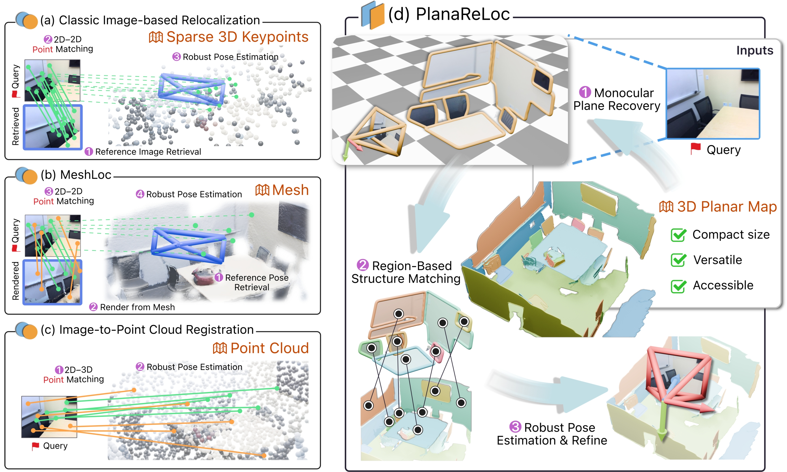

# PlanaReLoc: Camera Relocalization in 3D Planar Primitives via Region-Based Structure Matching

  

> PlanaReLoc: Camera Relocalization in 3D Planar Primitives via Region-Based Structure Matching \
> [Hanqiao Ye](https://timber-ye.github.io/), [Yuzhou Liu](https://paulliuyz.github.io/), [Yangdong Liu](http://3dv.ac.cn/en/faculty/ydl/), [Shuhan Shen](http://3dv.ac.cn/en/faculty/shs/) \
> CVPR 2026

## Abstract

  
<b>TL; DR</b> PlanaReLoc is a plane-centric paradigm for camera relocalization that matches cross-modal planar regions and estimates the 6-DoF poses, without relying on realistic map textures, pose priors or per-scene training. 

  While structure-based relocalizers have long strived for point correspondences when establishing or regressing query-map associations, in this paper, we pioneer the use of planar primitives and 3D planar maps for lightweight 6-DoF camera relocalization in structured environments. Planar primitives, beyond being fundamental entities in projective geometry, also serve as region-based representations that encapsulate both structural and semantic richness. This motivates us to introduce PlanaReLoc, a streamlined plane-centric paradigm where a deep matcher associates planar primitives across the query image and the map within a learned unified embedding space, after which the 6-DoF pose is solved and refined under a robust framework. Through comprehensive experiments on the ScanNet and 12Scenes datasets across hundreds of scenes, our method demonstrates the superiority of planar primitives in facilitating reliable cross-modal structural correspondences and achieving effective camera relocalization without requiring realistically textured/colored maps, pose priors, or per-scene training.

 

  
   
  <em>Teaser: Overview. (a-c) Existing approaches that establish point correspondences. (d) Our plane-centric paradigm establishes plane correspondences against plane-based 3D maps, enabling lightweight 6-DoF camera relocalization in structured environments.</em>

## To-Do List

- [x] Dataset Released on [ Hugging Face Datasets](https://huggingface.co/datasets/Hanchiao/PlanaReLoc). 
- [ ] Code will be released by June 3, 2026.